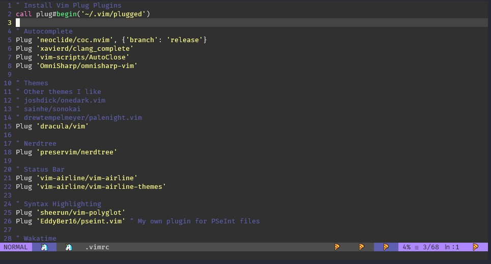

# Eddy's dotfiles
Here are my customized configs

## .vimrc

### Requirements
- Install [vim-plug](https://github.com/junegunn/vim-plug)
  ```bash
  curl -fLo ~/.vim/autoload/plug.vim --create-dirs \
    https://raw.githubusercontent.com/junegunn/vim-plug/master/plug.vim
  ```
- Install [Kite for Vim](https://github.com/kiteco/vim-plugin)
  ```bash
  bash -c "$(wget -q -O - https://linux.kite.com/dls/linux/current)"
  ```

- CoC:
  - Install [coc-emmet](https://github.com/neoclide/coc-emmet), [coc-clangd](https://github.com/clangd/coc-clangd), [coc-tsserver](https://github.com/neoclide/coc-tsserver), [coc-html](https://github.com/neoclide/coc-html)
    ```vim
    :CocInstall coc-emmet coc-clangd coc-tsserver
    ```

### Preview


## .bashrc

### Requirements
- Download git files
  ```bash
   curl https://raw.githubusercontent.com/git/git/master/contrib/completion/git-prompt.sh
   curl https://raw.githubusercontent.com/git/git/master/contrib/completion/git-completion.bash
  ```
- Install [w3m](https://sourceforge.net/projects/w3m/) for web search from terminal
  ```bash
  sudo apt-get install w3m w3m-image
  ```
### Prompt Preview

